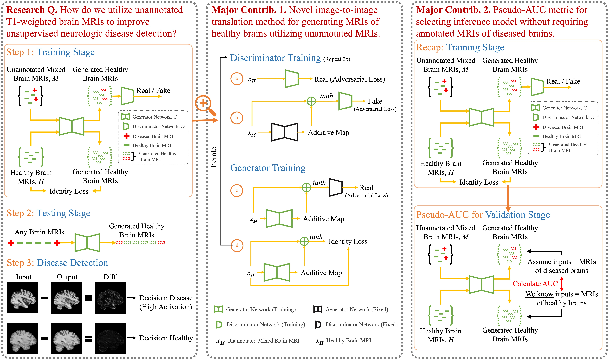

# Brainomaly
This repository provides the official PyTorch implementation of Brainomaly.

## Paper
**Brainomaly: Unsupervised Neurologic Disease Detection Utilizing Unannotated T1-weighted Brain MR Images**

[Md Mahfuzur Rahman Siddiquee](https://github.com/mahfuzmohammad)<sup>1,2</sup>, [Jay Shah](https://www.public.asu.edu/~jgshah1/)<sup>1,2</sup>, [Teresa Wu](https://search.asu.edu/profile/342678)<sup>1,2</sup>, [Catherine Chong](https://www.mayo.edu/research/faculty/chong-catherine-cat-ph-d/bio-20146998?_ga=2.180486759.1523948133.1540410816-481891997.1538001956)<sup>2,3</sup>, [Todd Schwedt](https://www.mayo.edu/research/faculty/schwedt-todd-j-m-d/bio-20091053)<sup>2,3</sup>, [Gina Dumkrieger](https://www.linkedin.com/in/gdumkrieger/)<sup>3</sup>, [Simona Nikolova](https://www.linkedin.com/in/simona-nikolova-59b7b18/)<sup>3</sup>, and [Baoxin Li](https://search.asu.edu/profile/747601)<sup>1,2</sup><br/>

<sup>1</sup>Arizona State University; <sup>2</sup>ASU-Mayo Center for Innovative Imaging; <sup>3</sup>Mayo Clinic<br/>
Under review

Paper ([Preprint](https://arxiv.org/pdf/2302.09200.pdf) | Camera Ready) | Presentation Slides | Poster

## Graphical Abstract



## Abstract
Deep neural networks have revolutionized the field of supervised learning by enabling accurate predictions through learning from large annotated datasets. However, acquiring large annotated medical imaging datasets is a challenging task, especially for rare diseases, due to the high cost, time, and effort required for annotation. In these scenarios, unsupervised disease detection methods, such as anomaly detection, can save significant human effort. A typically used approach for anomaly detection is to learn the images from healthy subjects only, assuming the model will detect the images from diseased subjects as outliers. However, in many real-world scenarios, unannotated datasets with a mix of healthy and diseased individuals are available. Recent studies have shown improvement in unsupervised disease/anomaly detection using such datasets of unannotated images from healthy and diseased individuals compared to datasets that only include images from healthy individuals. A major issue remains unaddressed in these studies, which is selecting the best model for inference from a set of trained models without annotated samples. To address this issue, we propose Brainomaly, a GAN-based image-to-image translation method for neurologic disease detection using unannotated T1-weighted brain MRIs of individuals with neurologic diseases and healthy subjects. Brainomaly is trained to remove the diseased regions from the input brain MRIs and generate MRIs of corresponding healthy brains. Instead of generating the healthy images directly, Brainomaly generates an additive map where each voxel indicates the amount of changes required to make the input image look healthy. In addition, Brainomaly uses a pseudo-AUC metric for inference model selection, which further improves the detection performance. Our Brainomaly outperforms existing state-of-the-art methods by large margins on one publicly available dataset for Alzheimer's disease detection and one institutional dataset collected from Mayo Clinic for headache detection.

## Usage

### 0. Cloning the repository

```bash
$ git clone https://github.com/mahfuzmohammad/Brainomaly.git
$ cd Brainomaly/
```

### 1. Creating python environment

```bash
$ conda create -n brainomaly python=3.9
$ conda activate brainomaly
$ conda install scikit-learn scikit-image -c anaconda
$ pip install tqdm pandas
$ pip install torch torchvision torchaudio --extra-index-url https://download.pytorch.org/whl/cu116
$ pip install neptune-client
```

### 1.1. Setting up the logging tool: Neptune.ai

We use [Neptune.ai](https://neptune.ai/) for logging the training and validation metrics. To use Neptune.ai, you need to create an account and get an API token. Then, you can set the API token in the `logger.py` file.

### 2. Downloading the dataset

- Alzheimer's Disease Detection Dataset (ADNI) [[Data Access Instruction]](data/ADNI.md)
- Headache Detection Dataset (Mayo Clinic) (Private)

### 3. Data preparation

The folder structure should be as follows (assuming your dataset name is MedicalData):

```python
├─data/MedicalData # data root
│ ├─train   # directory for training data
│ │ ├─pos   # positive class (diseased) images for unannotated mixed set
│ │ │ ├─xxx.png
│ │ │ ├─ ......
│ │ ├─neg_mixed   # negative class (healthy) images for unannotated mixed set
│ │ │ ├─yyy.png
│ │ │ ├─ ......
│ │ ├─neg   # negative class (healthy) images for known healthy set
│ │ │ ├─zzz.png
│ │ │ ├─ ......
│ ├─test   # directory for testing data
│ │ ├─pos
│ │ │ ├─aaa.png
│ │ │ ├─ ......
│ │ ├─neg
│ │ │ ├─bbb.png
│ │ │ ├─ ......
```

If your dataset is of 2D modalities, like X-ray, then you can just put your images as png files in the corresponding folders. If your dataset is of 3D modalities like MRI, then you need to store your images slice-by-slice as png files. In such cases, please rename each slice as `xxx__000.png`, `xxx__001.png`, `xxx__002.png`, ..., where `xxx` is the ID of the patient and `000`, `001`, `002`, ... are the slice numbers. For example, if you have a 3D image from a patient named `pat_001.nii.gz` with 100 slices, then you need to store the slices as `pat_001__000.png`, `pat_001__001.png`, ..., `pat_001__099.png`.

**Note for custom data**: Please adjust the image size and cropping according to your data.

### 4. Training

- Assuming your data folder is `data/MedicalData`: `bash train.sh MedicalData`

### 5. Testing

- Inductive testing: `bash test_inductive.sh MedicalData 400000`
- Transductive testing: `bash test_transductive.sh MedicalData 400000`
- AUCp calculation: `bash test_aucp.sh MedicalData 400000`

### 6. Testing using pretrained models

Coming soon.
