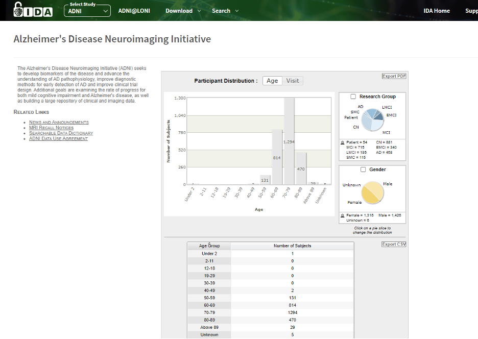
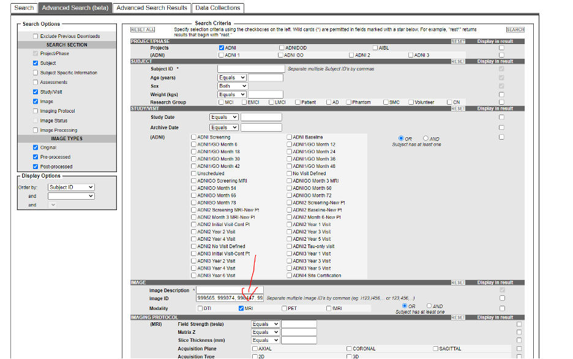
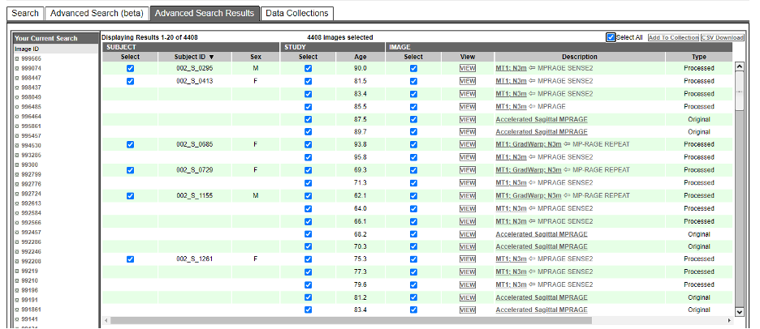
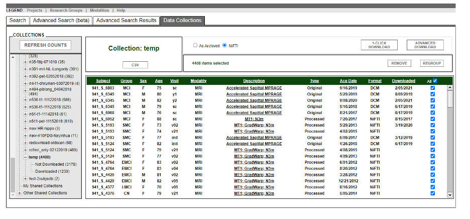

# Downloading ADNI Data

- Log in to [LONI](https://ida.loni.usc.edu/login.jsp)
- Select `ADNI`

- Under `Download`, select `Image Collections`
- Go to `Advanced Search` tab, enter the image id separated by commas (,)
  - You can get a list image ids from [ADNI_Patient_list.xlsx](https://github.com/mahfuzmohammad/Brainomaly/blob/714ace0bbd00376f36234590b89a9ab8cbd9184d/data/ADNI_Patient_List.xlsx) under the column `Inumber`

- Click `Search`, that will take lead to `Advanced Search Results` tab
- Click `Select All`, then click `Add To Collections`. It will ask to enter a name for the collection

- Select `All`. Click `As Archived` for dicom or `NIFTI` for nifti files. 
- Then click `1-Click Download` to start the download

